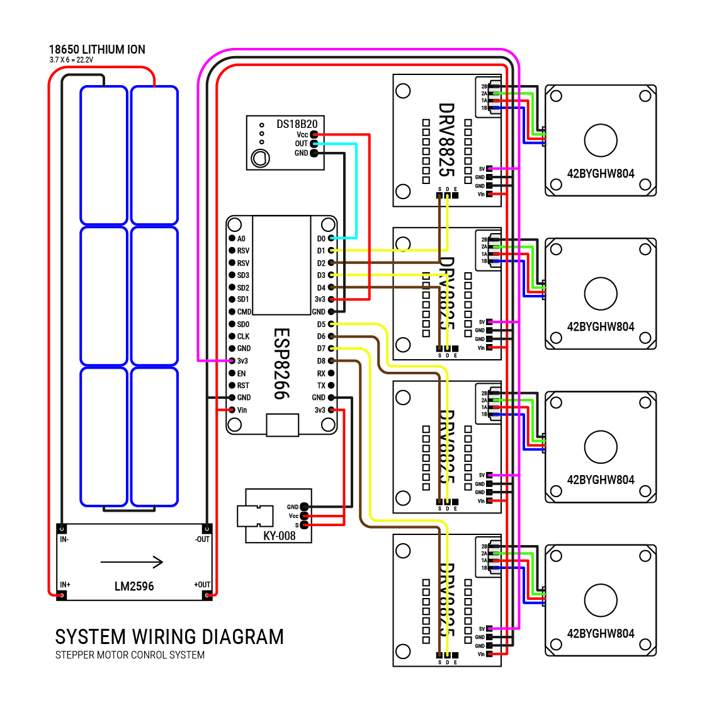

# STEM\_R1022024

ESP8266 Based Multi operated sequential Canal Trash Extractor

### Hardwares

**Stepper Motor**: Nema 17 4500g

> * Model : 42BYGHW804
> * Keynotes : Coil1 (BLACK & GREEN) Coil2 (RED & BLUE)
> * Input Voltage: 3.6v
> * Input Current : 1.2 A/PHASE
> * [Datasheet](https://grobotronics.com/stepper-motor-42byghw804.html?sl=en&srsltid=AfmBOoob1S9VRoTaBIgixzCNw4r2lPHLdatZdNhg1EAL_pg9pJvKSeLj)

**Stepper Controller**: DRV8825

> | Pin | Designation |
> |:-|:-|
> | E | Enable |
> | S | Step |
> | D | Direction |
> 
> * Input Voltage: 9v
> * Input Current: 1.2A
> * [Library](https://github.com/RobTillaart/DRV8825)

**Laser Sensor**: DS18B20

> * Input Voltage: 5v
> * [Info](https://forum.arduino.cc/t/documents-about-laser-sensor-ds18b20/1090450) Arduino Post

**Laser Emitter**: KY-008

> * Input Voltage : 5v
> * [Datasheet](https://datasheet4u.com/datasheet-pdf/AZ-Delivery/KY-008/pdf.php?id=1415012) pdf

### Microcontroller

**REFERENCE**

**ESP8266 PIN DESIGNATORS**

| Label | GPIO | Location |
| :---- | :--- | :------- |
| D1 | 5 | (STEPPER\_0) - D |
| D2 | 4 | (STEPPER\_0) - S |
| D3 | 0 | (STEPPER\_1) - D |
| D4 | 2 | (STEPPER\_1) - S |
| D5 | 14 | (STEPPER\_2) - D |
| D6 | 12 | (STEPPER\_2) - S |
| D7 | 13 | (STEPPER\_3) - D |
| D8 | 15 | (STEPPER\_3) - S |
| D0 | 16 | laser\_sensor |

### WIRING DIAGRAM

## UPDATE NOTES

09172024
 
  
Nema 17 4500g Stepper motor and along its driver DRV8825 module may experience heating during long operations. But, this is considered normal. Would advice better cooling options
  

09182024
 
  
On the documentations and diagrams it shows that the power supply Step-Down Converter was used is LM2595, But the one used is XL4015, Whats the difference? On paper XL4015 should deliver the needed power for all the devices. LM2595 can supply 3A at 150KHz While the XL4015 can deliver 5A at 180KHz [Refferences](https://www.reddit.com/r/AskElectronics/comments/u7nzyt/lm2596_vs_xl4015_demonstrably_different_one/). Considering The Nema 17 Stepper specified it can draw 1.2A per step, mentioned on the Nema 17 [Datasheet](https://grobotronics.com/stepper-motor-42byghw804.html?sl=en&srsltid=AfmBOoob1S9VRoTaBIgixzCNw4r2lPHLdatZdNhg1EAL_pg9pJvKSeLj). Testing the current inventory.